# 8/3 EWG PIF Meeting

[See agenda here](https://docs.google.com/document/d/16aW3D4W7hb0-s1VZ1pbN4zmuAqVOfPWy/edit)

## Introductions

- Tony Roberts - USFWS
- Sara - MS Student - TAMU
- Becky Stewart - CWS
- Pam Hunt - 
- Allison Fetterman
- Claudia Winters
- Matt Ziconi
- more...

### Online

Jocelynn Marriott 9:09 AM
Good morning! Technical Coordinator of the PIF Steering Committee, Program Support for the DoD Avían Knowledge Network

Jim Giocomo-ABC 9:09 AM
About 11 people raised their hands that they have not ever attended a EPIF meeting.

Becky Keller 9:10 AM
Becky Keller, Appalachian Mountains Joint Venture, American Bird Conservancy

Jillian Kilborn 9:10 AM
Jill Kilborn, Nongame Bird Biologist VT Fish and Wildlife

Kristin Mylecraine, NJ Audubon 9:10 AM
Kristin Mylecraine, New Jersey Audubon

Anna Buckardt Thomas- IA DNR 9:10 AM
Anna Buckardt Thomas - Iowa Dept of Natural Resources

Rich Bailey (WVDNR) 9:10 AM
Rich Bailey - WV Division of Natural Resources

Abby Valachovic 9:10 AM
Abby Valachovic, Nongame Bird Biologist NYS Dept of Env Conservation

Ted Cheskey - Nature Canada 9:11 AM
Ted Cheskey from Nature Canada here, from unceded Algonquin Anishnabek territory, today in Trois Riveres Quebec

Sharon Petzinger 9:11 AM
Sharon Petzinger - NJ Fish & Wildlife's Endangered and Nongame Species Program

Hazel Wheeler (they/them) - WPC 9:11 AM
Hazel Wheeler - Wildlife Preservation Canada

Katie Garst - WV 9:12 AM
Katie Garst - I'm a contractual Avian Biologist working with the West Virginia Division of Natural Resources.

Tania Homayoun - TPWD 9:12 AM
Tania Homayoun,  Nongame and Rare Species program at Texas Parks and Wildlife

walt emann 9:12 AM
Walt Emann, AmeriCorps Conservation Specialist at Audubon Vermont

Mark LaBarr 9:12 AM
Mark LaBarr-Audubon Vermont

Jim Giocomo-ABC 9:13 AM
Jim Giocomo, Central Region Director, American Bird Conservancy, in the room providing support for virtual participants.

Trish Nash 9:13 AM
Trish Nash - consultant working on biocultural landscape connectivity. Based in Unama'ki (Cape Breton, NS), the unceded ancestral territority of the Mi'kmaq.

## Breakout Groups

- Grasslands
- Temperate Forests
- Boreal Forests
- Shrub/scrub/ES

Share what you think is a critical implementation gap or need for the habitat/birds.

### Early Successional Group

- Discussion centered on fire management - everything else is sub-optimal management for ES.
  - Forest harvest - socially not popular
  - goats - not as well targeted
- Fire control has been removed from the USFWS - now called the US Wildland Fire Service. This group is now focussed on suppression (and "cleaning up the forests")
- Many of the collaborative networks are suffering under this new Federal system.

## Partners in Flight Overview

- working on updating vulnerability scores
- PIF International Science Committee - working on technical update to 2016 plan
- [World Migratory Bird Day](https://migratorybirdday.org)
- PIF Awards Committee restarting - call in Nov for nominations.
- PIF Industry Working Group
- EWG PIF - Data Management on "hiatus".


## How to Get/Be Involved

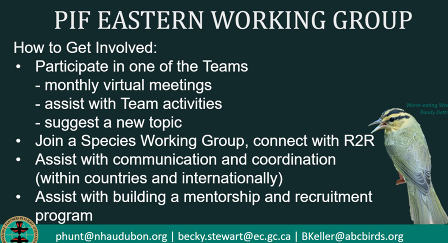

## Science Delivery

- 2 projects - habitat management guidelines database (HMG)
  - working to make database of BMPs and other items
- NE grassland bird business plan - how to implement at scale

## Full-Annual Cycle Conservation Team

- Focused on Bird Conservation Business Plans (Investment Strategies) - initial main focus.
- [Two major plans completed](https://www.selva.org.co/en/programs/migratory-ecology/conservation-plans/)
- These plans are part of a larger tapestry of work - six primary plans that are in place

> voiced - can't keep track of the number of plans! -> database/resource!

> Currently no good one-stop to find the plans - goal for the group

> AFSI has an ArcGIS Story Map to highlight the plans - would be nice to have for other projects!

### Road 2 Recovery - Species Working Groups

- meeting in Georgetown
- [Working Group Assessment Wheel](https://r2rbirds.org/resources/species-recovery-wheel/)

- on the ground research - "where to work and what to do"
- NCASI/Cornell - Decision support tool for Eastern Forests.

## Bird-Friendly City Certification Program

Ted Cheskey, Naturalist Director, Nature Canada

Theory of Change - needed for a better future state - most of these places have people who love birds and want them to have healthy populations.

- currently 41 bird-friendly cities - more people voted for city bird than in the local election!

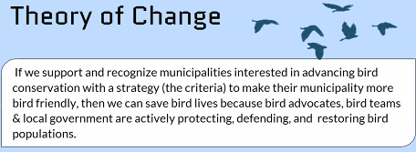

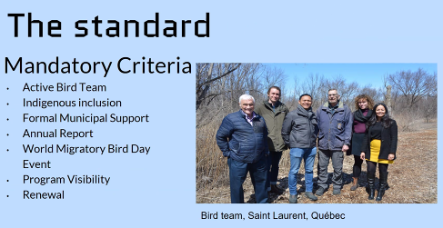

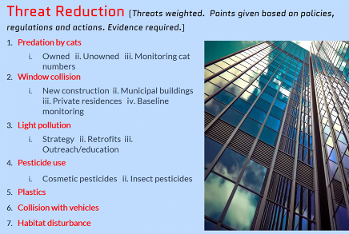

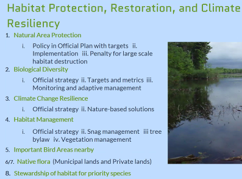

- Important Bird Areas being transitioned to "Key Biodiversity Areas"

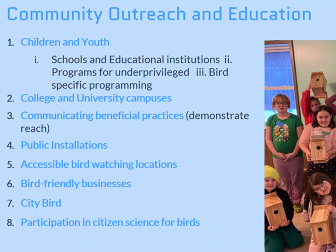

- Bird-Friendly Businesses - # as a proportion of population

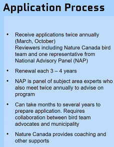

- applications 2x per year
- Municipality must be involved
- Tiered status is motivation for progress
- Aalia Khan research - impact of participating in a World Migratory Bird Day event
  - more likely to be involved after the event.

### Questions

- Anna Buckardt Thomas - Bird Friendly Iowa - cost? no.
- Kit - strategies for getting people excited?
  - community of practice - webinars (4-5 times/year), partnerships (80 bird teams, 40 certified cities), webinars allow sharing of lessons learned.
  - city bird election is huge, as well as the migratory bird day requirement


## Addressing Bird Collisions: Bird City Network and campus programs

Implementing Collisions Solutions in Your Community

Brian Lenz (ABC)

### How does the team work?

- Attempting to change the conservation about bird glass from after market to higher priority
- Interested in Working on Collisions
  - educate yourself
  - assess - where is biggest bang?
  - plan - ask?

### Which Buildings Cause the Most Collisions

- <1% high rise - kill a lot
- 44% homes
- 56% low-rise buildings

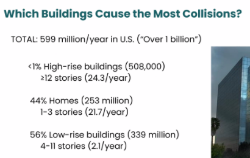

### Bird City Network

- started 2009
- lots of challenges for state-level programs - networks help avoid pitfalls
- tool, guide, conservation delivery network, action motivator
- ABC Support
  - website - add/improve/manage
  - works through state coordinating organization (not directly with communities)
- 16 programs, 300_communities, 4000+ recent actions

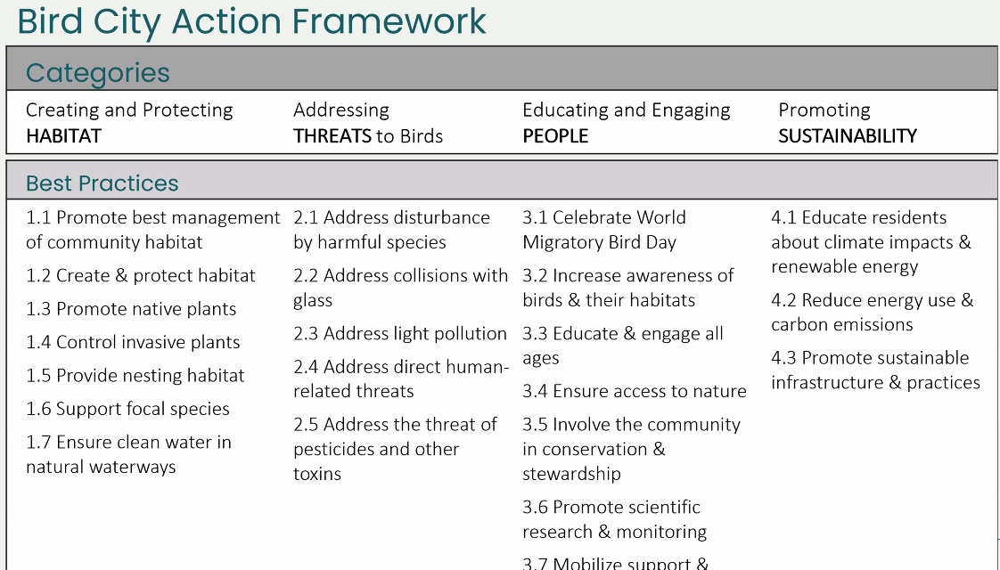

### Bird-Friendly Action on Campus

- student interest
- usually funding
- research
- goals

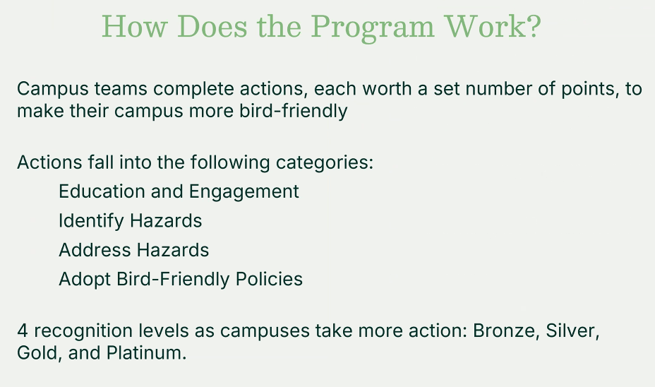

- each campus gets their own page
- consolidate parctices that work

``` yaml
task: work to connect with bird-friendly campus?
task: Kaelyn - does NatureCounts allow bird collision data collection? Media in photos?
```

### Questions

- Becky: Columbia/Mexico/Canada Bird Cities? - working through EFTA coordinators for MBD.
  - looking to transfer program to another org.
  - funding is the big barrier
- Monitoring Support
  - Some use [Used Survey123](https://survey123.arcgis.com/share/b2d2a92b64c742e399b426cb7afdf67e)
  - Another example: Nature Canada and FLAP Canada promote this survey 123 tool to collect data on whether windows are mitigated or not. https://survey123.arcgis.com/share/b2d2a92b64c742e399b426cb7afdf67e     FLAP Canada has its Global Collision Mapper https://www.birdmapper.org/
  - Brian Lenz: Hi - Kaitlyn Parkins is our monitoring expert. : ) We will be publishing a monitoring handbook with the campus program to help guide people to the right-sized monitoring program - importantly with well-defined goals - and help people sort out the kinds of questions you just asked.
  - There are multiple systems for collecting data, including FLAPS's Global Collision Mapper, dbird, iNaturalist, Survey1,2,3, ArcGIS, Excel, and more - all discussed in the handbook.

## UMass Collision Program

Monica Maestre (Rozy filling in)

- Students monitoring worst buildings

## How to Help Reduce Bird Collisions at Communications Towers

Jim Giacomo (ABC)

- see previous notes.
- [database here](songbirdsaver.org)

``` yaml
task: check NC towers for "easy" changes for Enforcement towers?
task: include "vision/mission" statements in entity definitions for organizations
```

## Discussion

[resource sharing document](https://docs.google.com/document/d/1v6u8EbSU5X5KCk2HAXP2YcXVM19mov9Vnk1vM-nD2pM/edit?tab=t.0)

- Sergio: no central effort for tower lighting - who is doing this work in states? Any entity organizing a national effort.
  - Brian - mostly from Joelle Goering's (USFWS) work. Created/promoted, but no organized campaign.
- Rich: WV has several mass mortality events on ridgetop setitngs, often with towers. Eager to engage with others in addressing some of these non-traditional point source mortality.
- Suggested Action: Further discussion on how these different groups connect across entities (Universities - Hemisphere)
- Upper Midwest JV Landbird Strategy - incorporated some of these

## LUNCH BREAK

## Full Annual Cycle Conservation

Becky Stewart

How does where I am working connect to the full annual cycle?

## Opportunities for Partnerships and Multi-species Conservation

Nick Bayly, Stefany Florez (SELVA)

- [Conservation Investment Strategy for Mid-Elevation Forests](https://www.selva.org.co/wp-content/uploads/2024/06/Conservation-investment-strategy-for-the-mid-elevation-forests-of-Central-and-South-America-FINAL.pdf) (2023)
  - 12 countries, >100 contributors
- prioritization process for identifying focal species - Wilson's Warbler
  - eBird Status and Trends as data source
  - Jan - Mar season used
  - Species findings prioritized in excel database - for establishing users own interests
- [ArcGIS StoryMap](https://storymaps.arcgis.com/stories/6b488df95f18445e87a58a03db50564d)

- Also evaluated endemic species that would benefit from conservation in the 14 focal geographies.

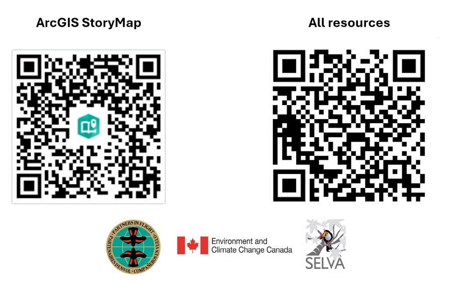

### Questions

- All landbirds whose distribution partly overlaps with mid-elevation forests.
- tracking efforts?
  - focusing on Columbia, but hard to get feedback
  - 100K acres of forests under new protection


## DOSELVA Presentation

Karina Giron-Doselva

- rural economy and access to international markets
- main approach is the species that work along ag processes - ensure farmers can continue to produce for farmers that are on the edge of viability
- None of these products are looking to replace the forests - work with growers to reduce stigma of working in "shade systems".
- Reducing the use of agro-chemicals
- make permanent presence of these trees
- reinforce resilience for climate change
- folks are part of the community - not just partners
- 90% working with women - working to reduce exploitation
- when producer is satisfied with level of production
- popular crops:
  - cardomom
  - pepper
  - ginger
- Certifications provide motivation
- Impacto Medio Ambiental - agrecultural forest systems
- 647 producers/growers are also allies
- 5 strategic crops
- DOSELVA: Spices for Impact
- "Agroforestry: respecting the shape that is already there"
- Started working with grower with 5 parcels of cardamom, but didn't know how to manage the crop. Producing 200 lbs at beginning, after 2 years now really well organized. All parcels restored, erosion control, managing shade improved. Now producing over 6K lbs! All from the improved management.
- DOSELVA connects agroforestry systems with US buyers. Key to improving the viability of these farms.
  - Yogi Tea is an example of spice manufacturer
- For choosing coffee (Nick Bayley): my recommendation is to look for any one of the following options, which mean that the coffee will most likely be grown under shade, regardless of whether it has a certification (Bird Friendly) or not: 1. 99% of organic certified coffee is grown under shade. 2. Most coffee from Honduras and Nicaragua is shade-grown, so is a fairly safe bet if you want to support Central American wintering birds. 3. In Colombia, certain regions are dominated by shade-grown coffee because of climatic conditions, so buying single origin coffee from the Sierra Nevada de Santa Marta, Santander, Cundinamarca or Huila will most likely support farmer growing coffee under shade and Andean wintering species like Cerulean and Canada Warblers, among others

``` yaml
node:
  organization-selva:
    type: organization
    title: SELVA
    short-key: selva
    description:
    tags: []
  plan-conservation-investment-strategy-for-the-mid-elevation-forests-of-central-and-south-america:
    type: plan
    name: Conservation Investemment Strategy for the Mid-Elevation Forests of Central and South America
  project-neotropical-migratory-bird-conservation-act:
    type: project
    name: Neotropical Migratory Bird Conservation Act
  organization-cerulean-warbler-birdscape:
    type: organization
    name: Southern Indiana Cerulean Warbler BirdScape
  organization-associacion-cerulea:
    type: organization
    name: Associacion Cerulea
```

``` yaml
idea: comparison of number of animals CERW v. White-tailed Deer
```

## The Cerulean Warbler and the People Working to Save it

Matt Williams - Sam Schein Foundation (Southern Indiana)

- seven target species, but this is the largest/most developed
- Cerulean Warbler BirdScape - international partnership with the goal to reverse population decline
- 59% of habitat is in private hands
- 5 teams (land, outreach/education, science/research, policy, full life cycle conservation)
- breeding grounds
  - mesofication of forests (intrusion of beech-maple in the mid-story due to lack of fire)
  - "strike team" doing habitat improvement in the area - removing 50-75% of mid-story - leaving the overstory oaks/hickories
  - following up with prescribed fire - growing local fire agencies
- Migratory (Costa Rica)
  - Partnering with SELVA
  - critical stopover site - working to protect this "corridor azul" - acquiring land to augment exisitng parcels.
- Stationary Non-Breeding Habitat
  - working with indigenous groups to develop conservation plans that work for the community- promoting eco-tourism **and** agriculture

3 year commitment - $1 million per year!!!

## Connecting continental priorities with regional conservation action in the Central Hardwoods Joint Venture

Sheela Turbek, Science Coordinator, Central Hardwoods Joint Venture

Translating continental scale objectives to regional scale.

Central Hardwoods JV

- starting with historical landscape
- Over time, gradually, transitioned from open forests and prairie to closed forest and agriculture
- Goals:
  - restore open forests
  - increase working grasslands
- How much habitat needed to recover priority species?
- Example: Cerulean Warbler
  - set regional pop targets: Short term goal = slow rate of decline by 60 - 75%

## MISSED 2 PRESENTATIONS

Sheela Turbek, Science Coordinator, Central Hardwoods Joint Venture -  Connecting continental priorities with regional conservation action in the Central Hardwoods Joint Venture

David King, US Fish and Wildlife, and Dave King (presenting), US Forest Service, retired –  US National Wildlife Refuges Contribute to Full Annual Cycle Conservation: stopover habitat in the Connecticut River watershed

## Becky Summary - Where to go next?

Great work - demostrating importance of connecting local communities and governments to the larger conservation goals. Large scale to small scale and back.

What might be some other topics that we might focus on as a FACCT?

JV stepping things down, CIS work, what would we need to connect global south and global north?

PIF Update (update ACAD and information) - how could this tap into JV? How can PIF help make connections?

> How much is storytelling needed? Are the success stories getting out there - examples of success that others might latch on to and imitate/emulate? Is there a gap in "knowledge of what is possible"?

> Two broad approaches here: meet people where they are - making sustainable ag more profitable vs. increasing public support for bird conservation.

## Western Working Group

Edwin Juarez

- CIPAMEX (Mex Ornithological Congress) - CWB actively engaging, organized PIF symposium and a round table discussion with early career professionals. Planning for 2027 in Guadalajara. Invited PIF to be more integrated. Typically 3 day event with presentations and the day before as workshops. Last day field trips. Dedicating PIF for full day. Highlighting the communities that live in these ecosystems.
  - probably week of Oct 18, 2027.
- ENCA - Mexico conservation strategy

## Wrap-up Conservation Actions

- PIF Science
- Indigenous integration/participation
- Towers - just get it done
- FACCT
- Grasslands

> how to incentivize conservation

> incentive-based: get folks to pay in to conservation actions by appealing to their current values/interests?

> values-based: work to change valuation of wildlife

> values-based: Work with industry to identify value-based organizations (B-Corps)?

``` yaml
task: are there any B-Corp in NCASI?
```


# 8/4 AOS Meeting

## Optimisymposium III

### Deepwater Horizon Spill

Andrew Cox

- unprecedented oil spill
- ~$500 million for bird restoration
- Dauphin Island acquisition, includingmanagement funding
- Nesting/foraging habitat restoration/creation
  - AMOY - built 5 nesting island, 5 intertidal reefs - expected to last decades
  - built 5 acre island to host 7K pairs of colonial waterbirds
    - cool design, built barrier, filled in some of interior, left one gap in barrier for beach inside protective walls
  - Breton Island restoration in LA - 136 acres added, 27K pairs of nesting birds
    - hope to get 20-30 years of investment
  - Chandeleur islands - 2.5K acres, >10K birds, $400 million! - uses different plots of funding
- 8K acres of conservation easements in Prairie potholes
- Seabird bycatch reduction in NW Atlantic - shearwaters and gannets
- vegetation mgmt and social attraction in the Dry Tortugas
- non-native spp removal from Puerto Rico Island

Conclusion: this is only a fraction. "Adding decades of additional life to habitat for 10s of thousands of shorebirds/waterbirds".
Partnership driven - very beurocratic, but work gets done.

#### Questions

- info about spill? Yep, there is a website.

> Add events to the knowledge graph?

### Restoration of Common Loons in MN

Tim Mitchell (MN)

- Migration research funded by State Lottery!
- Evidence that MN Loons were affected by the Deepwater Horizon Oil Spill
- Activities
  - acquired and protected lakeshore nesting/foraging habitat - 6 parcels/7 miles of shoreline - leveraged partnerships b/c shoreline parcels in demand!
  - laka ssociation outreach - citizen monitoring; 50+ lake mgmt plans; be loon aware
  - Artificial nesting platforms (ANP) installation
    - doing research to refine process
    - higher productivity; 42% usage (adoption increased over successive years)
  - reduce lead exposure through nontoxic tackle advocacy
- Diversified, creative funding
  - license plates
  - ML soccor team with
  - stae lottery


### La Playa que Vuela: Community-Based Monitoring and Avitourism as a Conservation Strategy

Balalantyne Puin Castano
LinkedIn: ballantyne-puin

- Columbia: biodiverse, multiethnic, and multicultural
- Location:Buenaventural, Punta Soldado Island
- Coastal erosion transformed the landscape, losing shorebird habitat
- 2022, 2025, beach was restored, shorebirds returned
  - Tourism emerged as a new economic opportunity
- How to create a sustainable business model?
  - 2023 discovered birds
  - 2024: learned to observe/identify them
  - 2025: we became their guardians - community-based monitoring
  - cross sectoral collab (local; NGOs, logal gov, etc)
- 15 shorebird species recorded
- Threats: garbage, dogs, 
- promoting ecotourism for the area
- Conclusions
  - youth are the key drivers of conservation and local stewardship
    - "we were never told we could be part of the solution"
  - community-based monitoring
  - sustainable livelihood models are essential to ensure long-term consrvation
- Looking ahead
  - high levels of unmet basic needs remain a major challenge
  - Mental health, well-being, and conflict resolution are essential fo sustaining community-led conservation
- work with commuity 

### Boring Name, INspired Work: Bird Conservation Investment Strategies

Becky Stewart

Using the approach of CIS to advance landscape scale conservation for birds - outcome-based plans, multiple priorities

- Need many birds in decline, scale is large, no on can do it alone;
- Key Components  
  - most use Conservation Standards
  - led by Latin American Orgs
  - outcome-driven: "by 2033, increase tree cover by 27,500 ha in SA and 9,800 ha in CA within mid-elevation forests
  - Common goals for multiple priorities
  - eEnable collab at scale
  - funder update 

### Piping Plovers on urban Beaches: A conservation Success Story in Massachusetts

Drew Vitz

- Example: Revere Beach SP - hihgly urban, near T Stop, 2.5 miles of beach
- Analyzed productivity and nesting fino over 2015 - 2025 for multiple sites in MA
- urbanization positively associated with nest survival
- Exclosures - 84% ireduction in nest failure
- Nest survival probabliity decreases over season
- no effect detected with nest overwash and abandonment rate
- strong negative trend in productivity, but 10.8% annual increase over the time period


# 8/5 AOS

## Plenary

### Stopover research

Fengyi Guo (Freda)
fg329@cornell.edu
@fyguo.bsky.social

- radar analysis indicates that stopover habitat ofr landbirds is highly associated with forest patches
  - some of these patches are sometimes not considered important for breeding, due to the presence of predators
  - note that birds who don't rely on forests (e.g., grassland birds) likely don't benefit from forest stopover
- The corn belt is an antrhopogenic migration barrier
- ongoing work on population trends during sopover to identify drivers of declines
- Working Lands fo rWildlife
  - 66.7% of identified hotspots are not protected areas.
    - collaborating with NRCS for WLFW program - provides financial/technical assistance to working lands
    - stopover hotspots will be used as ranking criteria for Deciduous Forest Framework (DFF)
    - First time landbird stopover sits will be used in national conservation planning
    - 

> big gaps in the radar coverage. Any work to identify other sources that might help fill in the gaps?

### Farming with the flock: Redesigning agricultural systems for people and nature

Olivia M. Smith
Michigan State University

- Agriculture has expanded 5x over the last 300 yr
  - largest biome on earth (38%)
- Trends
  - larger field size (fewer edges)
  - less diverse plantings
- Ecosystem services
  - cultural - people like them around
  - pollination, pset control, etc.
- Some harmful effectsa as well, eating eating products scat on crops
- Surveyed 58 famrs from WA to California 1

## NCBA Data Review Discussion With Julie Hart and John C

[See notes in this document](https://ncconnect.sharepoint.com/:w:/r/sites/WRC_NCBirdAtlas/Shared%20Documents/Science%20Subcommittee/ebird_data_review/NCBA%20Records%20Review%20Notes.docx?d=wc9b197c2ff2b477fba9c151cbd40b8a6&csf=1&web=1&e=pjugT9)

## SECLP Coaches Call

## PIF Steering Committee Call

# 8/6 AOS

## Columbia Talk

- Using morphology from AMNH 1911 collection to modern collection to investigate relationships between morphology and changes in the landscape over the same landscape.
  - deforestation, etc.
- Lowlands app have shorter wings
- longer tails in 61% of populations across all localities
- What might be th eeffects (locality, evolutionary history heat exchange hypothesis)?
  - heat exchange - hotter climate selects for smaller spp
- 60% of populations, wing length decreased in related to tail length (longer tails)
  - usually translates to maneoueverability

## Desired Future Conditions Framework - Missouri River HIlls

Joeseph Moseley
Advisor: Tom Bonnot

- Landscape Management Challenges
  - Resource restrictions
  - Qualitative targets
  - Competing habitat goals
- Missouri River Hills - oak0hickory dominatied uplands; historic conservation initiatives and species like RUGR
  - mostly private, some game land holdings
- Habitat Suitability Index
  - Structure; Composition; Context -> HSI composite score
  - 1.0 condituions fully meet needs; 0.0 meets no needs
- RUGR rate poorly; EWPW has much higher - what scenario makes it somewhat suitable for both?


## Bird-Friendly Futures: Linking Science & Empathy in Successful Bird-Safe Building Advocacy

Meredith Barges - PhD Candidate SUNY
Viveca Morris - Exec Dir - Yale Bird-Friendly Building Initiative
Richard Fadok - Rochester Institute of Technolgy
Nick Lund - ME Audubon


### How did you become involved in this issue?

Richard - cultural anthropologist


> What does it mean to give an invitation to participate in the work of living more in collaboration with the natural environment? How to change perspective that we are separate from nature?

> Interested in how to leverage this issue into a larger narrative about the acknowledgement of our impacts while working more in line with natural services.

``` yaml
idea: start collection of bird strike birds at WRC HQ? Partner with NCSU to taxidermy birds?
idea: NatureCounts can log dead birds - great platform for a universal bird collision survey database?
```

### How to link science and empathy?

- avoid "cost per bird" - put into context of # of birds killed for the lifetime of the building
- scaling collisions to the human scale - in the time for this session 175,000 birds killed (averaged out over city)
- empathy works better than statistics
  - photos of dead birds - in hand
  - engaging people in the drama of bird life
  - our society doesn't like death

### Remember a time when an image/data helped someone understand the problem?

- "guilt and shame works well"

### What do you think is the new frontier of science to advance bird collision policy?

- better detail about targeted treatment.
- better bird safe glass
- how do you get a bill passed? how do you convince a legislator?
  
> Meredith: who are bird friendly buildings for?

> How do we hold empathy while acknowledging our unavoidable impact on birds?

# 8/7 AOS

