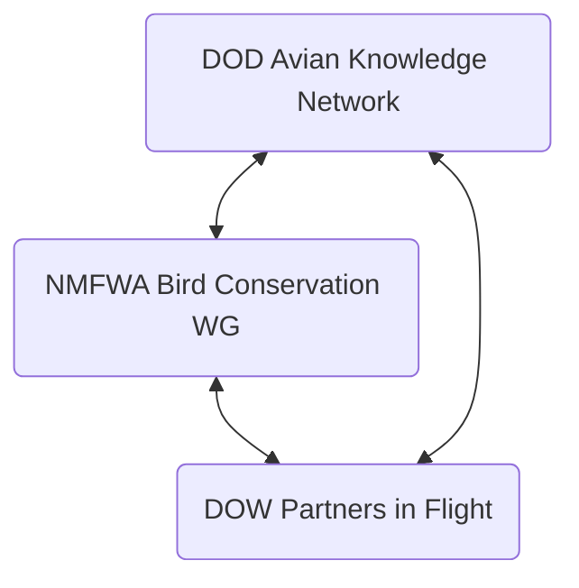

# Summary

- Opportuntity for NCPIF/NCWRC: Outreach Campaign for converting tower lighting (BCC I)
- [Bird Flu Map](https://birdflumap.org) maps current/recent AI information including poultry, bovine, and wild bird HPAI detections
- Southern Wings [Full Annual Cycle Online Guide](https://southern-wings.fishwildlife.org/online-guide)
- DOW Avian Knowledge network provides a lot of help with entering data
  - working on API - potentially providing a methodology to host our data externally, and display on our website via Shiny, or other web app.
- ACAD (Bird Conservation of the Rockies) is looking for funding for support of the database. Lobbying folks to manage a Multi-state Grant (Bradley already talked to Sylvania (AFWA MSG person)).
- [Partners in Flight Action Brief](https://partnersinflight.org/resources/partners-in-flight-action-brief-2026/)
- [American Bird Conservancy](https://abcbirds.org/strategies/communications-towers/) has campaign to help spread the word about preventing tower collisions. List number of towers in states, and recommendations under new research and regulations for modifying to be less lethal (steady -> blinking lights)
- USGS now hosts a new tool to map AI incidents: [Bird Flu Map](https://birdflumap.org)
- AFS developing a leadership database - findings on leadership opportunties - looking for advisory board mmembers - will meet at Sep AFWA conference

# Table of Contents

- [Summary](#summary)
- [Table of Contents](#table-of-contents)
- [3/30 1315 Bird Conservation Committee I](#330-1315-bird-conservation-committee-i)
  - [Partners in Flight](#partners-in-flight)
  - [New Tools from the Avian Knowledge Network](#new-tools-from-the-avian-knowledge-network)
  - [SGARS Tooklkit](#sgars-tooklkit)
  - [Reforming Bird- and Fish- Related Working Group](#reforming-bird--and-fish--related-working-group)
  - [Peventing Cell Tower Collisions and Opportunities for States](#peventing-cell-tower-collisions-and-opportunities-for-states)
  - [Habitat Mgmt Information Needs for Marsh Birds](#habitat-mgmt-information-needs-for-marsh-birds)
  - [BBL/BBS](#bblbbs)
    - [USGS](#usgs)
    - [BBL](#bbl)
    - [BBS](#bbs)
    - [New WebTool](#new-webtool)
    - [AG Rodenticides](#ag-rodenticides)
  - [Briefing: Southern Wings](#briefing-southern-wings)
    - [set state-specific investment goals (similar to fall flights)](#set-state-specific-investment-goals-similar-to-fall-flights)
    - [Strengthen governance](#strengthen-governance)
    - [Expand participation and impact](#expand-participation-and-impact)
    - [Advisory Committee](#advisory-committee)
    - [Communications Campaign](#communications-campaign)
- [3/31 1315 Wildlife Viewing and Nature Tourism](#331-1315-wildlife-viewing-and-nature-tourism)
  - [6th WVNT](#6th-wvnt)
  - [Beyond the Binoculars: What eBird Data Tells Us About Wildlife Viewing on WMAs](#beyond-the-binoculars-what-ebird-data-tells-us-about-wildlife-viewing-on-wmas)
  - [The "Public -\> Data -\> Public Loop: Facilitating Engaging Projects](#the-public---data---public-loop-facilitating-engaging-projects)
  - [WVNT Updates from States/Orgs](#wvnt-updates-from-statesorgs)
  - [Ongoing Comms Tools](#ongoing-comms-tools)
- [4/1 1730 National Flyway Meeting](#41-1730-national-flyway-meeting)
  - [Pacific Flyway Update](#pacific-flyway-update)
  - [Mississippi Flyway Update](#mississippi-flyway-update)
  - [Atlantic Flyway update](#atlantic-flyway-update)
  - [Central Flyway Update](#central-flyway-update)
  - [Joint Venture Update](#joint-venture-update)
  - [Avian Knowledge Network](#avian-knowledge-network)
- [4/2 NMFWA AKN: from boots on the ground to big data](#42-nmfwa-akn-from-boots-on-the-ground-to-big-data)
  - [Three Orgs](#three-orgs)
    - [NMFWA Bird Conservation Working Group](#nmfwa-bird-conservation-working-group)
    - [DOW PIF](#dow-pif)
    - [DOW AKN](#dow-akn)
  - [NMFWA Bird Conservation Working Group: The voice from the field](#nmfwa-bird-conservation-working-group-the-voice-from-the-field)
    - [Regulations and Permitting - MBTA/Eagle Protection Act](#regulations-and-permitting---mbtaeagle-protection-act)
      - [Reviewing types of MB permits](#reviewing-types-of-mb-permits)
      - [BAEA/GOEA Protection Act](#baeagoea-protection-act)
  - [DOW Partners in Flight](#dow-partners-in-flight)
    - [opportunities for Engagement](#opportunities-for-engagement)
- [4/2 Leadership and Professional Development Committee](#42-leadership-and-professional-development-committee)
  - [AFS Update](#afs-update)
  - [MAT Updates](#mat-updates)
  - [Leadership Training updates](#leadership-training-updates)
    - [NCLI](#ncli)
      - [Cohort 19](#cohort-19)
      - [Cohort 20](#cohort-20)
    - [NECLP](#neclp)
    - [SECLP](#seclp)
    - [WCLDP](#wcldp)
  - [CLfT](#clft)
- [4/2 PIF/Shorebird/Waterbird Working Group](#42-pifshorebirdwaterbird-working-group)
- [4/2 Bird Conservation Committee II](#42-bird-conservation-committee-ii)

# 3/30 1315 Bird Conservation Committee I

1:15 - 3:15p

Judy Camuso, Bradley Wilkinson

## Partners in Flight
Jocelynn Marriott, PIF

Tagline: "Resources, Relationships, Tools"

[Action Brief](https://partnersinflight.org/resources/partners-in-flight-action-brief-2026/)

- overview of activities
  - TOR
  - Budget subcommittee
  - Comms & Engagement
  - PIF International Scienc Committee - feature in Avian Conservation and Ecology
    - 9 peer-revieweed articles
  - ACAD
- Western WOrking Group
  - CECAM 2025 and CECAM 2026
  - Desert Thrasher Working Gorpu
    - integrating protocols into AKN
    - Studying movements of Thrashers in AZ/NV
  - Thurs, Apr 2 DOW Joint Bird Session - 8a - 12p
- Science Delivery Team
  - Conservation Strategy Database
  - Eastern Grassland Bird Conservation 
- Eastern Working Group
  - R2R WORKSHOP IN aPRIL
  - aos MEETING aUG 3
- Industry Working Group
  - Angie Larsen-Gray, PhD
  - revitalizing this working group
- World Migratory Bird Day 33rd year
  - PIFs Flagship awareness program
- Awards Committee
  - 2027 call for nominations -> November 2026
- Priority Budget Items
  - Awards: $3K - 8K
  - Translation: $4.5K - 

## New Tools from the Avian Knowledge Network
John Alexander, KBO

"Partnerships, Data, Technology"

- Also serves as decision support tool
  - observation map
  - data downloader
  - PPhenology Tool
  - Rapid Avian Info Locator
- "Conservation Planning and Regulatory Alignment"
  - "data discovery
  - Trends?
  - Regulatory Requirements
- Atlantic Flyway Colonial Waterbirds
- Recovered over 1 million records - USFS, DOD, NASA
- [ ] BACS data into AKN!

> Thoughts - perhaps list of topics, deep dive into one of them? Lots of info to digest, feels like it gets swamped.

> What might be a good illustrator prodcut? Colonial Waterbirds trends across the system?

## SGARS Tooklkit
Bradley Wilkinson, AFWA

> Essentially an update of work since last North American.

- Identified 5 themes
  - scientific review
  - state-level regulations
  - beneficial practices for state agencies to adopt integrated pest mgmt systems
  - Toolks for public education
  - limiting factors in advancing state-led
- Capacity needed especially to address Chapts 3 and 4
- Target completion is Fall 2026 (AFWA Annual Meeting)
  - Publication logistics in progress - if not by next NA mtg

## Reforming Bird- and Fish- Related Working Group
Bradley Wilkinson & Ali Schwaab, AFWA

- Want to revive - b/c of issues coming up lately with DCCO, others.
- met virtually 26 January 2026
- Tim Birdsong (TPWD), Fisheries Co-Chair
- search underway for Bird Co-Chair
- Core Challenge
  - birds that eat fish create tension with fisheries management and aquaculture
  - Conflicts are growing
  - Goal: Help states navigate challenges with biologgically sound, legally durable tools
- January meeting
  - focused on DCCO
  - significant impacts on aquaculture and wild/stocked fish populations
  - current management tools are limited - central problem
- current tools
  - individual depredation permits
  - DCCO special permit: more programmatic, but has significant limitations
  - neither tool is holistically meeting needs as conflicts grow in scale
- Cormorant relief act
  - would reissue AQ DO
  - Expands authority to state-licensed private lakes an pond managers
  - separate legislation being explored for public resource impacts
- Flyway model?
  - Federal population-level quotas
  - states set where, when, and how takse is implemented
- other emergent issues
  - neotropic cormorant problems
  - AMWP problems
  - Eash spp has distinct regulatory complexities.
- next: Meeting Spring of 2026
  - continued work on braod white paper
  - fish chiefs survey to be discussed
  - Structured discussion of neotropic cormorants and AMWP
 
## Peventing Cell Tower Collisions and Opportunities for States
Steve Holmer, American Bird Conservancy

- ABC - 160 staff
- Approx. 6-7 million deaths annually
- steady lights worse than blinking lights
- Started documenting in the 1940s
- Towers with guy wires ^ mortality
- taller towers worse than shorter ones
- Found that blinking lights were safer for aviation as well
- Legislation in 2015 started transition...
- 335 towers in NC!
  - have list of owners for each state - but a little dated.

- Towers <305 ft, just turn off the lights
- >350 ft, need to transition to LED flashing lights
- Now doing campaign (state wildlife agencies, governors, conservation coalition)
- USFWS video "[WIn-Win for Towers](https://www.youtube.com/watch?v=pLHNROmSS2U)"

## Habitat Mgmt Information Needs for Marsh Birds
[Bob Holsman](mailto:bholsman@djcase.com), DJ Case and Associates

- Focusing on marsh bird spp
- State agencies - connecitng information sources and support /resources they need
- Habitat Literature Review - Kristen Malone [Wetland management practices and secretive marsh bird habitat in the Mississippi Flyway: a review](https://wildlife.onlinelibrary.wiley.com/doi/abs/10.1002/jwmg.22451)
- Review of available assets and tools
  - SWAPs
  - Tech reports
  - asset inventory
- Too much information?
  - 

## BBL/BBS
Jennifer Malpass, USGS

### USGS

- staff shrinking - lots of doubling up
- Ecosystems Mission Area Programs
  - connections with CRUs
  - Ecosystem Science centers
  - CASCs
- CRUs
  - 725 active students
- Bird Research
  - 10 themes

### BBL

Working towards an integrated scientific program

- still delivering permits, data, reporting to public, etching bands
- Transformation: same mission, new engine
  - exploring AI Assistance

### BBS

- 60 years!
- 1966-2024 analysis online
- soon: 1966 - 2025 raw data
- changing how "operators" do data mgmt

### New WebTool

[Bird Flu Map](https://birdflumap.org)

maps current/recent AI information including poultry, bovine, and wild bird HPAI detections

### AG Rodenticides

collaborating with other s on virtual events early 2026
- 1/2 day symposium this meeting

## Briefing: Southern Wings

Deb Hahn (Bradley prsenting), AFWA

lots of forward momentum after presidental taskforce

International collaboration to conserve shared priority migratory birds throug annual cycle conservation

- [Full Annual Cycle Online Guide](https://southern-wings.fishwildlife.org/online-guide)
- Presidential Task Force

### set state-specific investment goals (similar to fall flights)
  - formula based on biological(migratory SGCNS) and birdwatchers
 
### Strengthen governance

  - new advisory committee (Kendra Wecker, Ohio DW)
  - Tech committee: tate agency staff thet help inform and guide the program

### Expand participation and impact

- coordinated between Deb and Bradley

### Advisory Committee

- direct recommendation from the Presidential Task Force
- Modeled after Fall Flights advisory Committee
- Representatives from each regional association
  - Flyway councils
  - BCC
  - PIF
  - National Audubon
  - ABC
  - BCOR
  - DU
- Charge: oversee implementation of Southern Wings
  - oversee
  - implement recommendations
  - set priorities
  - help achieve funding objectives

### Communications Campaign

- connecitng with state agency leadership
- State agency profiles [NC Profile](https://southern-wings.fishwildlife.org/online-guide/north-carolina)
- 

```yaml
nodes:
    organization-bird-conservation-committee:
        title: "Bird Conservation Committee"
        key: organization-bird-conservation-committee
        type: Organization
        url: "https://partnersinflight.org/what-we-do/science/"
        relationships:
            bcc|is_committee_of|afwa:
                title: "Association of Fish and Wildlife Agencies"
                key: organization-association-of-fish-and-wildlife-agencies
                verb_forward: "is committee of"
                verb_backward: "has committee"
                source: "Scott K. Anderson"
    person-bradley-wilkinson:
      title: "Bradley Wilkinson"
    project-sgars-toolkit:
      title: SGARS Toolkit
      relationships:
        bcc|has_project|sgars-toolkit:
          title: Bird Conservation Committee
    organization-bird-fish-working-group:
      title: Bird- and Fish- Related Working Group
    project-marshbird-factors:
      title: Marshbird monitoring project
      relationships:
        dj-case|leads|project-marshbird-factors:
          title: DJ Case and Associates
    resource-avian-knowledge-network:
      title: "Avian Knowledge Network"
```


# 3/31 1315 Wildlife Viewing and Nature Tourism

## 6th WVNT

- [WVNT Academy Website](https://wvntacademy.com)
- Great recap of conference, encouraging others to attend

## Beyond the Binoculars: What eBird Data Tells Us About Wildlife Viewing on WMAs

Deniz Aygen, IDFG

- Internal R Dashboard tools
- Mostly track eBird Activity
- Used the data to improve infraastructure at a site

## The "Public -> Data -> Public Loop: Facilitating Engaging Projects

Scott Anderson, NC Wildlife Resources Commission

NatureCounts is another option

## WVNT Updates from States/Orgs

## Ongoing Comms Tools

- Webinars, Facebook Group, Monthly Calls
- NORC - National Survey? Got multi-state grant to do the survey
  - will be asking about 2025
  - Will be a lot about participation - no expenditure questions
  - Dive deeper into birding (not necessarily wildlife watching only)
  - 30K interviews - all info available by the AFWA meeting
  - More user friendly format?
- States can buy-in to the survey - can pay through AFWA - Jeff Yattaw
  - $90K and up - can pay over 3 years
  - WR and SF funds can be used.

# 4/1 1730 National Flyway Meeting

> Sparsely attended. Probably only about 25 folks in here.

## Pacific Flyway Update

??

- MBTA letter - encouraging greater enforcement
- 3 regulatory recommendations
- renominate Kelly Straka (and others) to NAWCA

## Mississippi Flyway Update

Scott

## Atlantic Flyway update

Brad Howard, NCWRC

- letter for SWG, NMBCA
- letter of support for PEFA EA
- endorsed GOEA procedure for falconry

## Central Flyway Update

Shaun Oldenberger, TPWD

- HPAI update (new apps) - USFS Malpass
- Fall Flights - Andy Radeke
- NAWCA - money starting to flow back to Canada

## Joint Venture Update

[Rich Shulteis](mailto:rich.schultheis@pljv.org), Playa Lakes Joint Venture coordinator

- NAWMP and Joint Ventures very tied together
- [Migratory Bird Joint Venture](https://mbjv.org)
- Many JVs have had to reasses their funding strategies, reliance on federal funds for work they do (IRA, RCPP cancellations, Reimbursement delays, etc.)
- NAWCA funding
  - $49 million (flat) appropriated in 2026
  - Wetlands conservation and Access Improvement Act of 2025 (HR 2315), signed into law in 2025

## Avian Knowledge Network

John Alexander, Klamath Bird Observatory
[Liz Neipert](mailto:elizabeth.s.neipert@erdc.dren.mil)

- "Support a network of partnerships, data, and technology to improve bird conservation, management, and research across organizational boundaries and spatial scales."
- Examples
  - Desert Thrasher Working Group - standardized field methodologies
  - Short-eared Owl Landscape Study (from PIF/Waterbird/Shorebird WG)
- Flyways and Colonial Waterbirds
- Question: is there an API (i.e., could you write a Shiny App to pull directly from AKN?)
  - working on APIs


> Attended NMFWA dinner - very impressive. They are able to do a lot of good work on military bases with a lot of funding!

# 4/2 NMFWA AKN: from boots on the ground to big data

AKN - NMFWA Bird COnservation Working Group - DOW PIF

## Three Orgs



> [Check out this way to make maps in markdown.](https://docs.github.com/en/get-started/writing-on-github/working-with-advanced-formatting/creating-diagrams)

### NMFWA Bird Conservation Working Group

- voice from the field
- facilitates comms/info exchange

### DOW PIF

- subject matter expertise and planning

### DOW AKN

- deliver modern data mgmt system

## NMFWA Bird Conservation Working Group: The voice from the field

USFWS (Migratory Birds)

- Mandy Lawrence (Permit Policy Lead)
- Matt Stuber (Raptor and Energy Lead)
- Sarah Lessard (Regulation and Policy Lead)

### Regulations and Permitting - MBTA/Eagle Protection Act

- Branch of Bird Conservation
  - Jo Anna Lutmerding - BCC, etc.
  - Jennifer Miller

#### Reviewing types of MB permits

- see website - Migratory Bird Permit Memorandum Series

#### BAEA/GOEA Protection Act

- Do not need a permit to "haze" eagles, as long as it does not cause disturbance to a nest
- incidental take can include:
  - home construction
  - prescribed burn
  - anything where the primary intent of the activity is not to disturb the Eagle or nest
  - Can authorize morality or injuries (i.e., power lines)

## DOW Partners in Flight

[website](https://partnersinflight.org/working_groups/dod-pif/)

### opportunities for Engagement

- working groups
  - mission-sensitive species
  - research/monitoring
  - eagles
  - energy, infrastructure andMission resilience
  - education/outreach
  - BASH
  - invasive species

[DOW PIF Coordinated Bird Monitoring Plan](https://partnersinflight.org/working_groups/dod-pif/)

# 4/2 Leadership and Professional Development Committee

Dave Golden (NJ)
Riley Peck (UT director)
Elena Takaki

[website](https://www.fishwildlife.org/afwa-acts/afwa-committees/leadershipprofessional-development-committee)

## AFS Update

Jeff Kopaska, Executive Director

- Multi-state Conservation Grant
- Focusing on training for those not in positions of authority
- Project to assess training needs, and build online database
- Will send survey to collect data to Fish Chiefs (and Directors)
- Looking for folks to be a part of the advisory board. <- send to Rachael?
- presenting at AFWA
- Partnering with TWS

> states structured differently - NJ has an entire nongame division

## MAT Updates

- Leadership Launchpad - very popular among younger folks
- Conservation Leaders confluence - 6-part webinar series - popular among early career folks
- MSCG
  - continue online training
  - training resources guide/directcory - some state agencies doing great training - want to be a resource to share experience.
    - need info about who the training lead for your agency is

> chaortic leadership?

## Leadership Training updates

### NCLI

#### Cohort 19

#### Cohort 20

- recruiting now!
- Due April 15

### NECLP

### SECLP

### WCLDP

## CLfT

# 4/2 PIF/Shorebird/Waterbird Working Group


# 4/2 Bird Conservation Committee II