# Summary

- Migratory Stopover Planning Tool derived from Audubon data. [In a shiny app here](https://rebrodie56.shinyapps.io/MB_CPT_v1/) - has stopover data for CERW, GWWA, WOTH
- Opportunity: Smaller group looking to plan a project to evaluate stopover hotspot quality and value. Groundtruth stopover maps/models with surveys and color banding/tracking/body condition at paired hotspot and non-hotspots.
- Working Groups that participated: WOTH, BITH, BACS, EWPW, GWWA, CONW, CHSW, CERW

# April 14

## Road to Recovery History

Held at 111 Massachussetts Avenue - renovated building, now home to Georgetown new Institute.

```yaml
nodes:
  organization-road-to-recovery:
  short_key: r2r
  title: Road to Recovery
  type: organization
  description: Non-profit formed to address issues highlighted in the 3 Billion Birds paper.
  tags: [non-profit, birds, 3 billion birds]
```

## Workshop Goals

Katie Holland

### Goals

1. Explore the R2R process for Eastern Tipping Point Species (and others)
2. Explore the topic of migratory stopover habitat conservation

### R2R Process

- limiting factors during migration?
  - where on the journey?
  - what is the threat?
  - When is the impact? When is the population impacted?
  - How significant is the impact?

### Day 1 Agenda

- R2R Framework and Recovery Planning
- Spp Working Group Breakouts
Lunch
- Migratory Stopover Tools
- Discussions

### R2R Recovery Progress Wheel

Intended to track recovery of species, not evaluate or compare Working Groups. For tipping point species, not recovered, so wheel by definition will be incomplete.

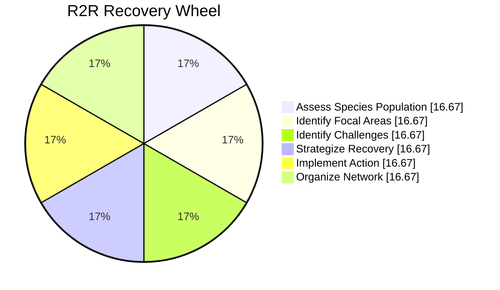
```mermaid
pie showData
  title R2R Recovery Wheel
  "Assess Species Population" : 16.67
  "Identify Focal Areas" : 16.67
  "Identify Challenges" : 16.67
  "Strategize Recovery" : 16.67
  "Implement Action" : 16.67
  "Organize Network" : 16.67

```
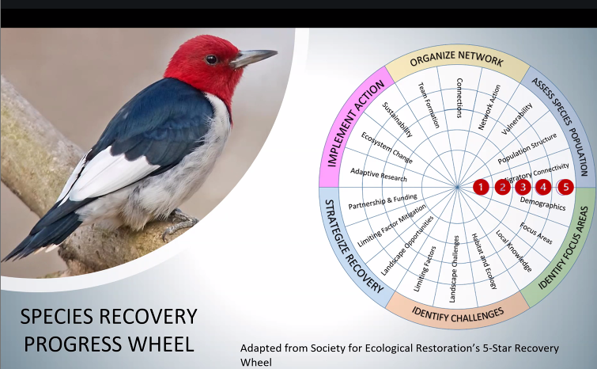

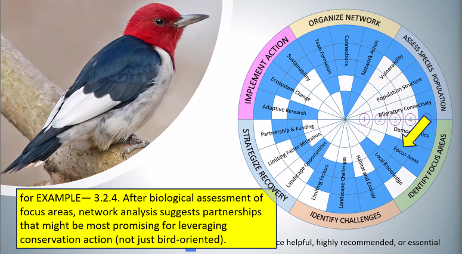
If you don't have a network, can't do a network analysis!

Diagrams are designed to go from inside (1) to outside (5), but this does not always make sense in term of development.

### Combining Single Species and Ecosystem Approaches

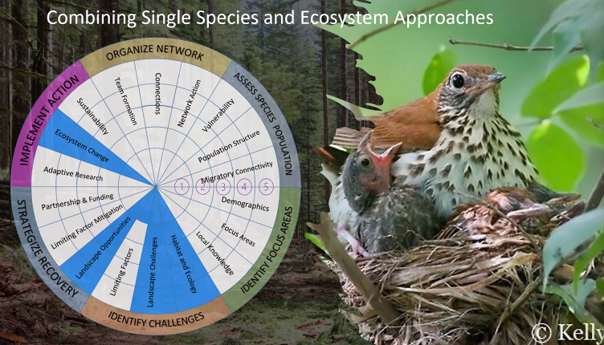

Focus on 1-3 this morning.

### Addressing Inclusivity

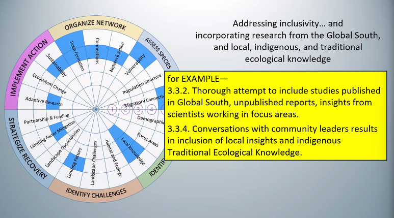

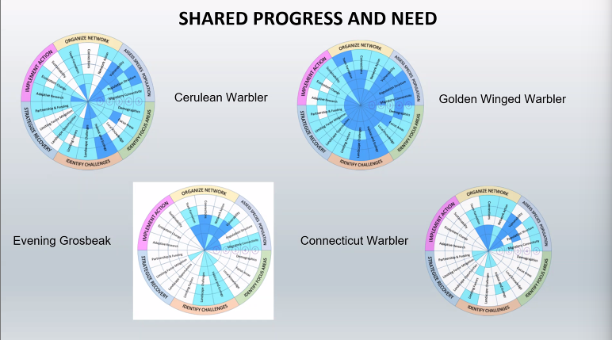

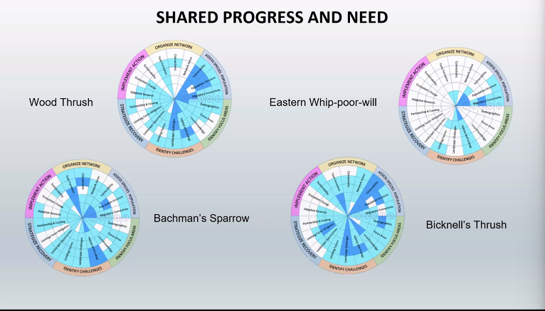

### Assignment for today

Not updating the wheel - should be done at another time.

Today, look at completed wheels, and prioritize what is next for the group.

Note: organize ntework is a common problem - 1.1.5 Group organizational plan and clear rules of engagement established.

[Mural Board](https://app.mural.co/t/r2r2624/m/r2r2624/1775662614622/d5d7f84389d482dfdeb0b0a2e54e1ad0c682dbd8)

## EWPW Working Group breakout

See [mural board](https://app.mural.co/t/r2r2624/m/r2r2624/1775662614622/d5d7f84389d482dfdeb0b0a2e54e1ad0c682dbd8) with information.

- Initial focus on building out network?
  - Develop list of names of people who might be interested? Be mindful of the ask for help/resources.
- Cultural significance of this species in the Ozarks - elsewhere?
- Peele: Nexus with Hurricane Helene recovery efforts?
- Not a lot of knowledge among group with the [Nightjar Survey Network](https://nightjars.org)
- Leader is [Christopher M Tonra](mailto:tonra.1@osu.edu)

## Migratory Stopover Tools

Randy Dettmers (USFWS)

### Overview

- latest tech/monitoring efforts
- gather feedback about questions about state of knowledge/comfort
  - do we know enough to start doing something?

### Aeroecology Program at U of Delaware

Jeffrey Buller

- 1/3 of US covered by radar - continuous data for >30 years
- Since 2008, 250m pixel resolution
  - scan every 5-10 minutes
- During migration, probably more biology than meterology in the data.
- [Stopover Hotspot Patterns and Protection Status](https://doi.org/10.6084/m9.figshare.22306738)

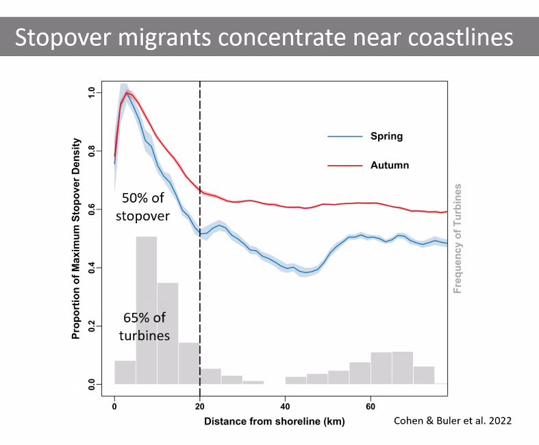

- Some radar networks in Mexico, Brazil, not as openly available.
- Canada working to make their network available.

### Mapping stopover hotspots for state-level conservation planning

[Claire Nemes](https://clairenemes.weebly.com)
[cenemes@gmail.com](mailto:cenemes@gmail.com)
[claire.nemes@umce.edu](mailto:claire.nemes@umce.edu)

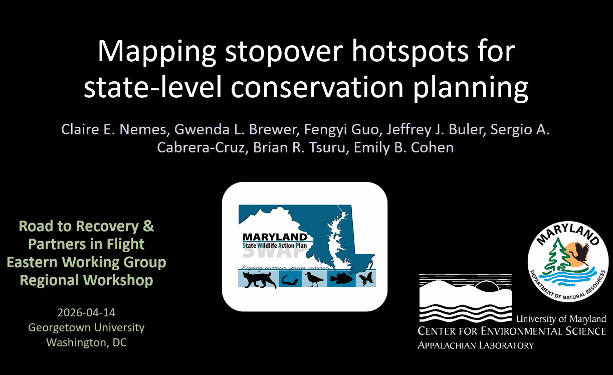

- Lots of great research with advancement of technology
- Comes with a sizeable research-implementation gap
  - [Fabian et al 2019](https://www.sciencedirect.com/science/article/abs/pii/S0006320718312163), [Kadykalo et al 2021](https://andrewkadykalo.com/wp-content/uploads/2021/06/kadykalo-et-al.-2021_cobi.13732.pdf)
- Looked at SWAPs

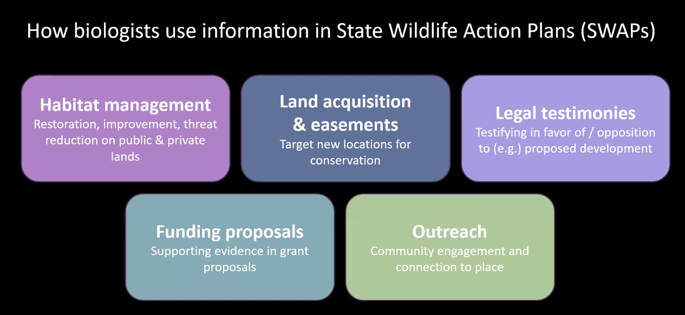

- most SWAP focus on breeding season, but MD has also worked for migrants.

#### Example Data

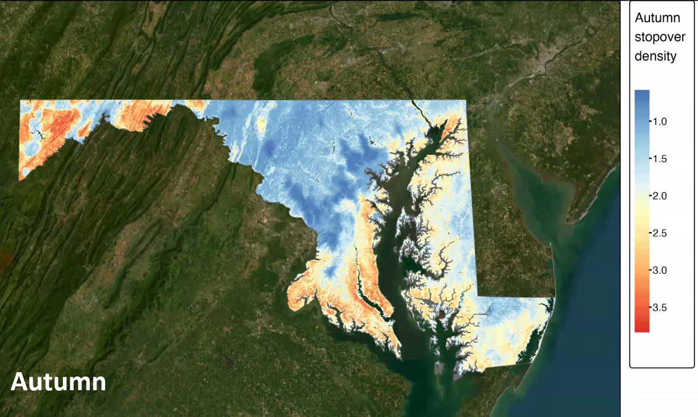
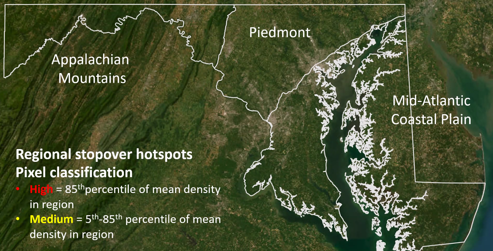
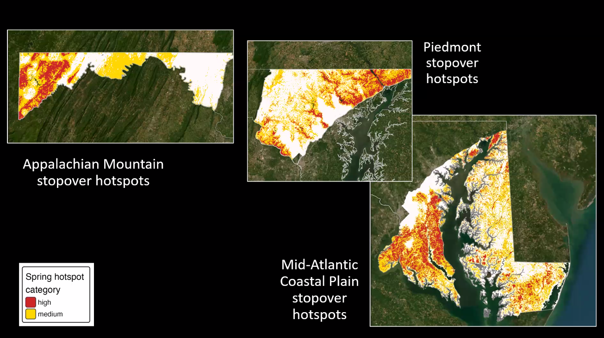

### Using Multi-phase migration Models to Inform Conservation Planning

Bill Deluca, Director of Migratory Science
[Ryan Brodie](mailto:ryan.brodie@maine.edu), University of Maine
[Paper](https://doi.org/10.1093/ornithapp/duag030)

#### Merged Migration Maps

- integrated full annual cycle data from tagging, eBird, band data
- working to incorporate Motus
- working to integrate active stopover sites (not considered in v1.0)

#### Species examples

- GWWA, CERW, WOTH, CAWA

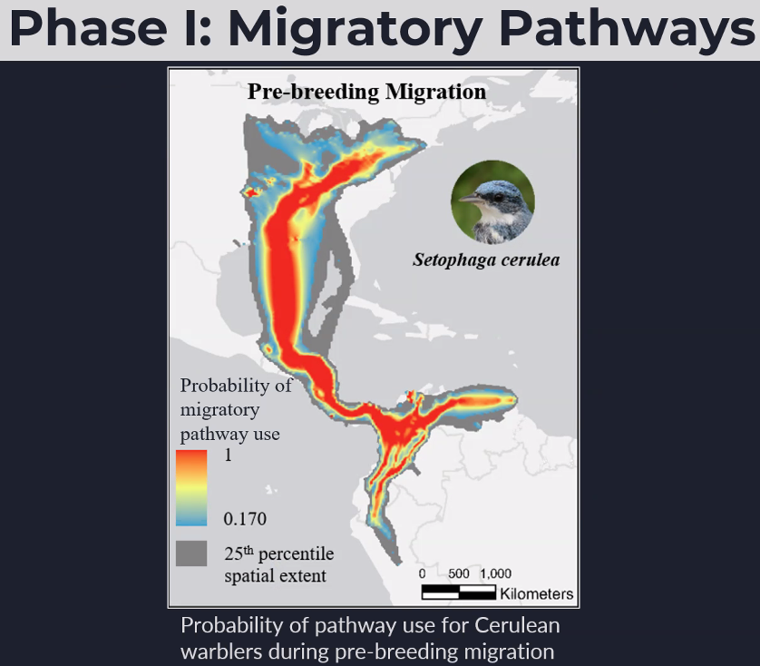

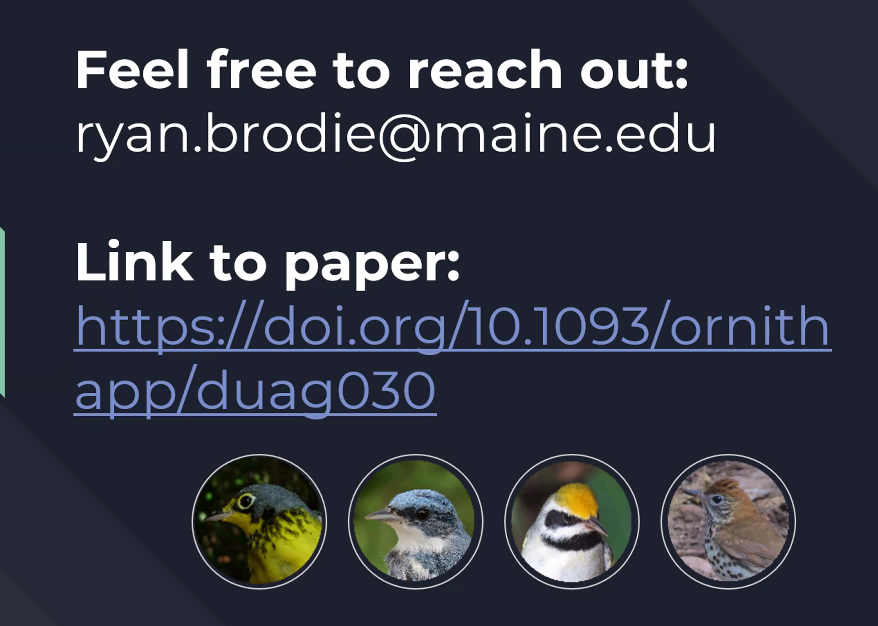

### Bird Concentration Areas: A Framework to identify important locations for bird communities during migration

[Fabiola Rodriguez-Vasquesz](mailto:fgr23@cornell.edu)

- to identify migratory bird communities, we need distributiion data across space and time
- Essentially stacking eBird Status Layers to identify highest value of bird presence, sum to bird concentration indicies.
- Identify areas that support a high number of individuals
- Identify areas that support a high number of species
- Delineating BCAs for forest-asssociated, migratory species

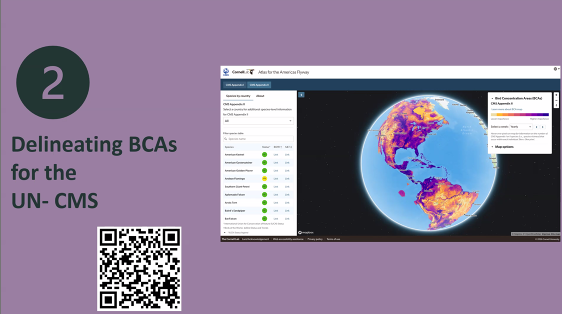

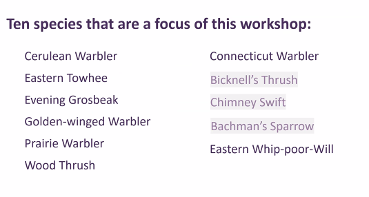

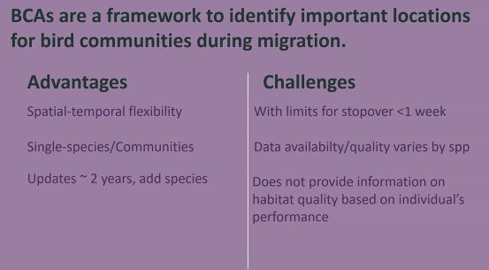

## Break

[Mural](https://app.mural.co/t/amjv1762/m/amjv1762/1774892799153/08f64371257d45cc5f7337b926fdf3f2b048c067)


## NCASI Project

Lots of effort put into ground truthing data, including vegetation and formal bird surveys.

High expense for commercial forests.

# April 15

## Demonstrations: Bird Conservation Areas

Fabiola Rodriguez (Fabi)

[See Mural for links/examples](https://docs.google.com/document/d/1HCgOM2wyiZKtFw7txJCJcH0CDr8lxWg5MYAJbinSvi8/edit?usp=sharing)

- mapping Bird Concentration Index richness and abundance for migration...

## Migratory Bird - Conservation Planning Tool

[Ryan Brodie](https://github.com/rebrodie) - U of ME

- [R Shiny Tool](https://rebrodie56.shinyapps.io/MB_CPT_v1)
- [Also available on the Upper Miss JV](https://umgljv.org/partner-conservation-tools)
- Migratory Pathways - Bill Deluca and Ryan
  - simplified version of Audubon movement tracking, least-cost paths, etc.
- Some interpolation about pre- and post- breeding timing.

## Seasonal Exposure to hemispheric Conservation Challenges Influences Population Trends of Migratory Warblers

[Jeffrey Ritterson - National Audubon]

- Audubon Bird Migration Explorer
- 19 challenges, 9 categories
- 458 species, 88 standardized threats, Stresses (7 from IUCN)
  - [Threat Sensitivity Matrix]() - not shareable yet.
- In general, post-breeding migration was biggest mortality risk for spp.
- 

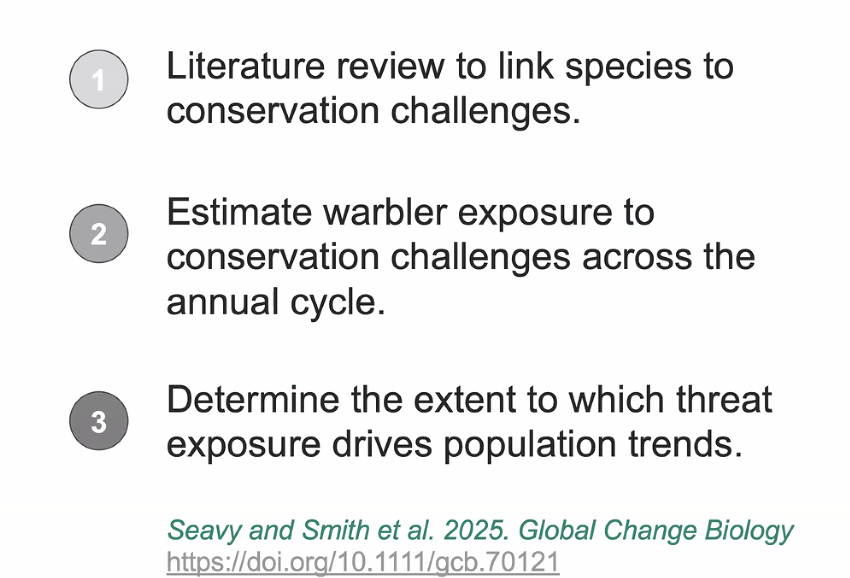

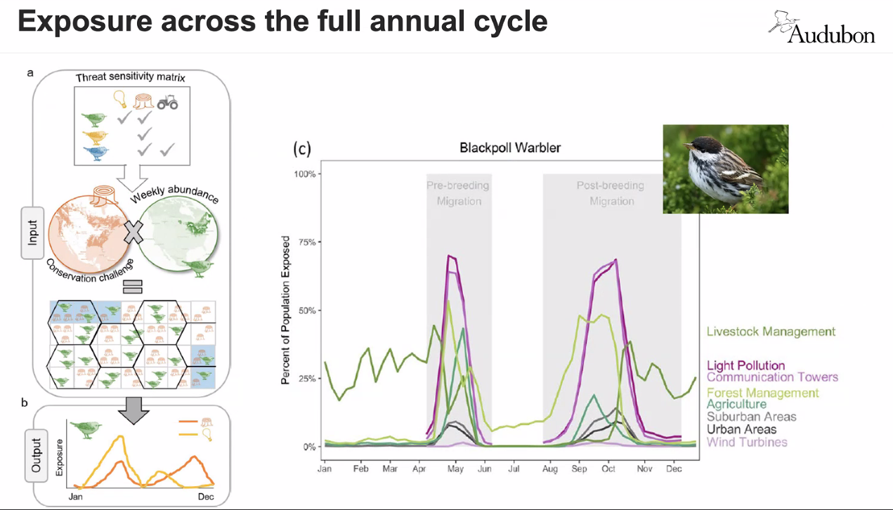

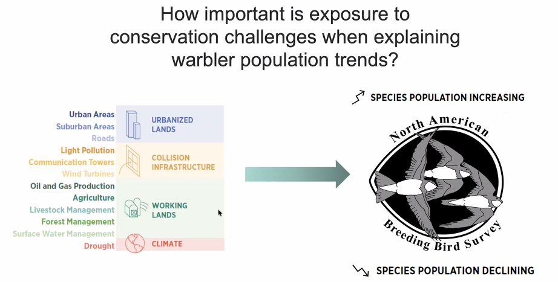

## Human Dimensions

[Katie Holland]

- Focus Area Profile - develop broad context for needs
  - Embedded in wheel
- Refer to Action category 3 "Identify Focus Areas"
  - largely HD focused
  - Integration is critical here.

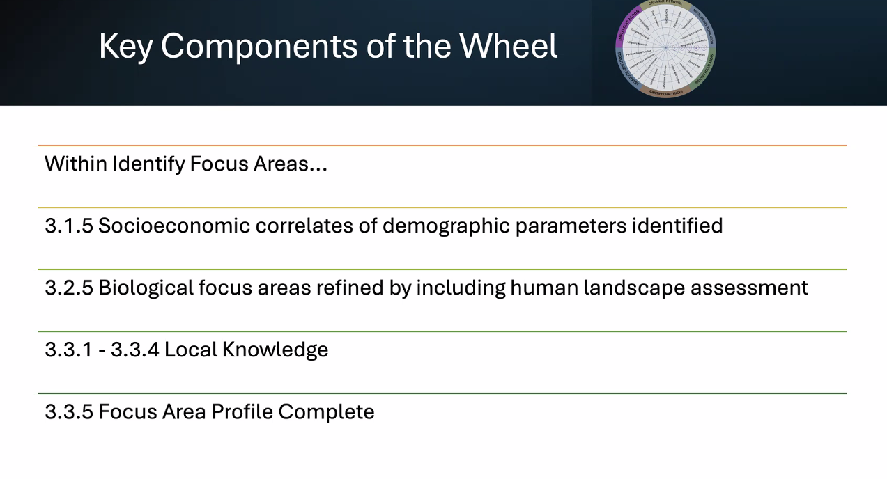

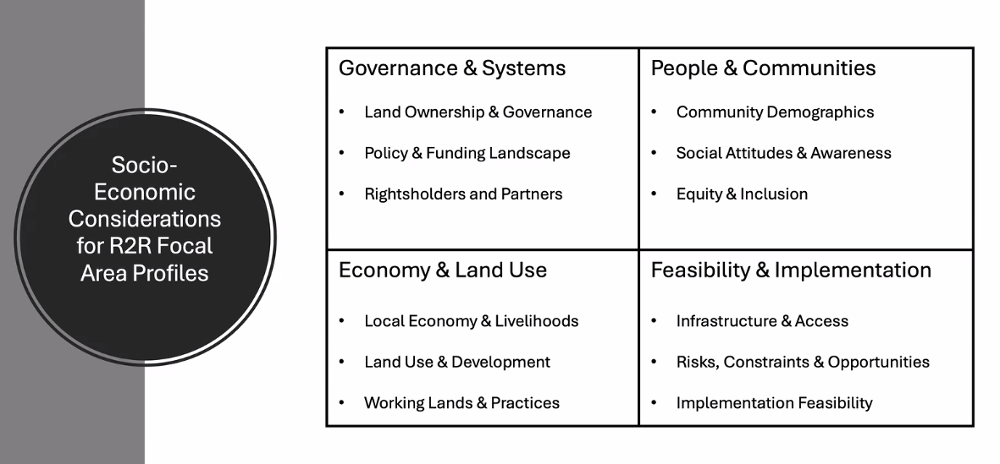

### Social Attitudes and Awareness

- "How do we get people to care?"
- Birding numbers off the charts, how do we get them to care (usually meaning behaviors)?

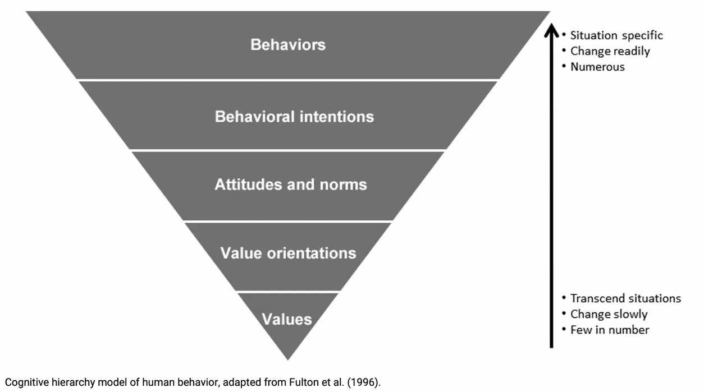

- it is really hard to change values - easier to change behaviors
- Outreach doesn't change values

### Wildlife Value Orientation Changes

- Shifting away from utilitarian towards mutualism

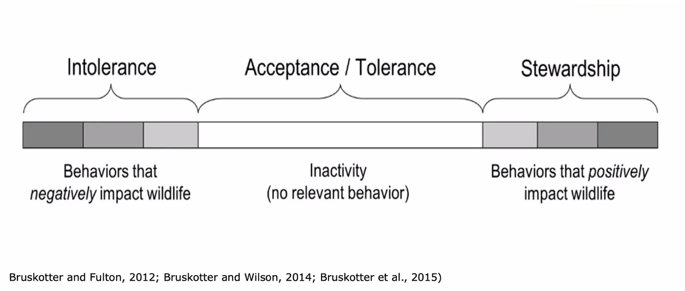

- typically, goal is tolerance, but for tipping point species, we need more.
  - who here has treated windows? how can we expect others to treat their windows?
- Have we experienced a baseline shift? Tolerance isn't good enough?

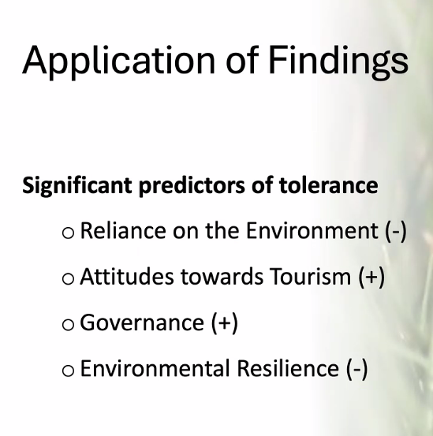

- Reliance on Environment (+)
- Attitudes towards Tourism (+)
- Governance (+)
- Environmental Resilience (-)

- Human Communities are nested
  - critical to consider all levels when thinking about community engagement, support, and suitability

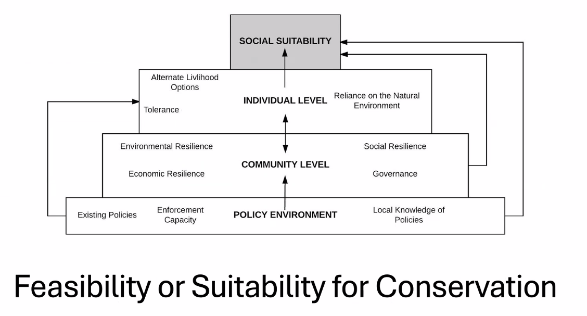

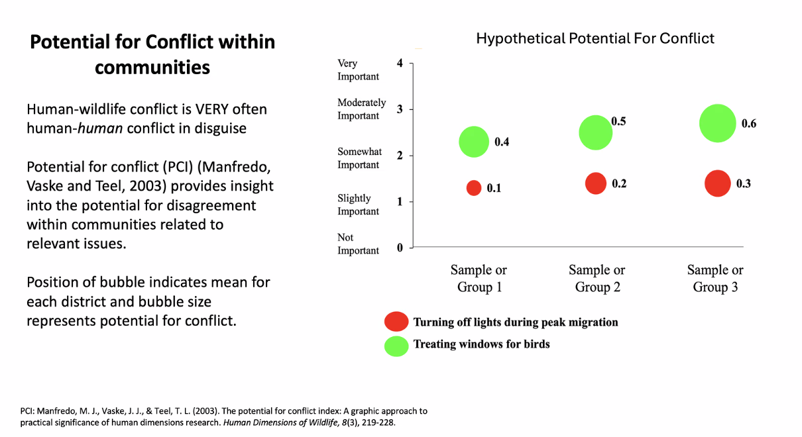

- tipping point spp recovery requires species-specific approaches
- Human communities often require community-specific approaches

[Wildlife Valuation Studies](https://sites.warnercnr.colostate.edu/wildlifevalues)

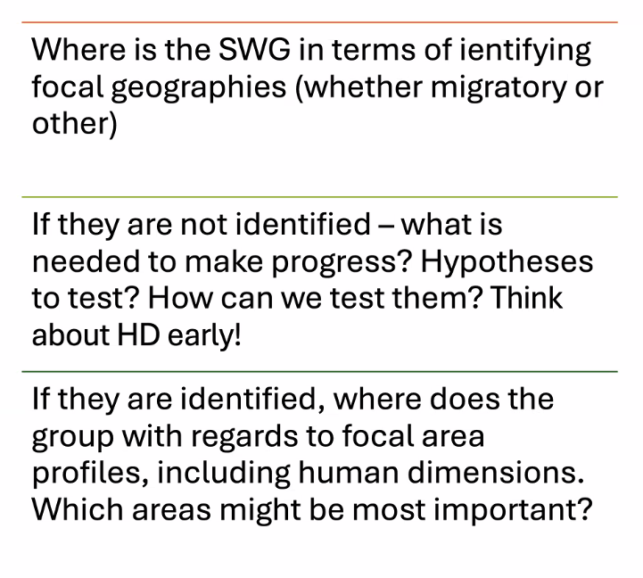

### EWPW Working Group

- would like to pull data from SWAPs in range
- Issue: often nighttime checklists aren't complete in eBird
- would like to reach to to states...

## Breakout Group on Stopover Habitat Evaluation

