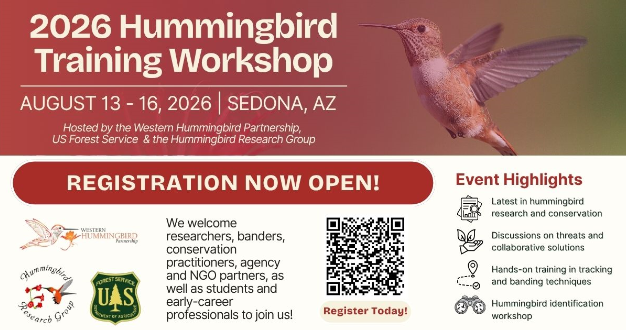
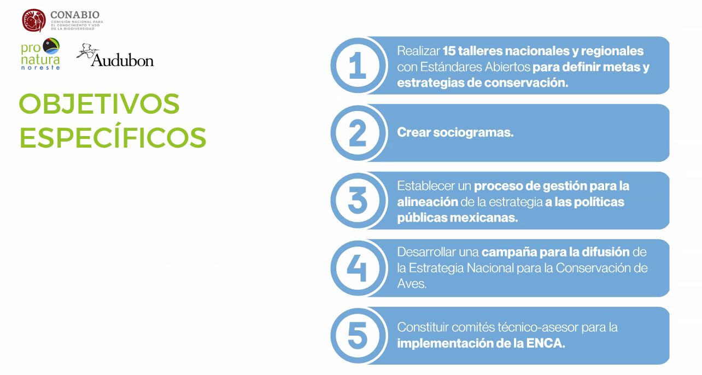
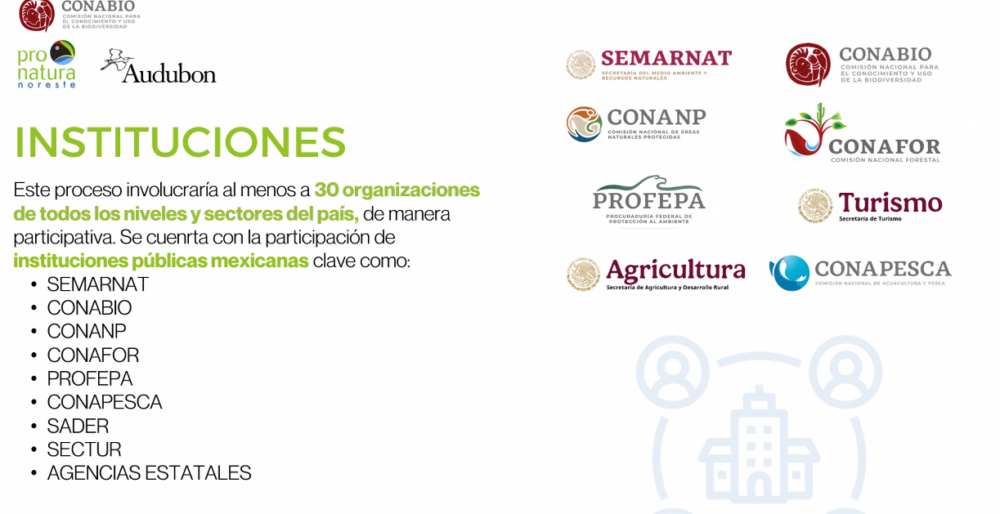
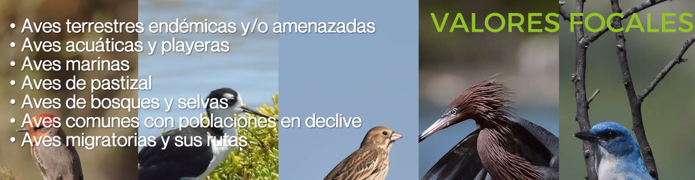
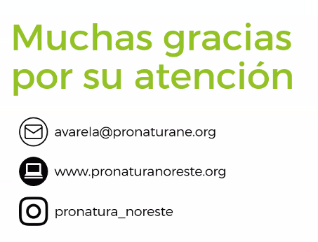

# Introductions

- Sue Bonfield - [Workshop Aug 13-16 for Hummingbird conservation]()

- Scott Kraynak - BirdsCanada/ABC project
- Allison Paules - Western bird banding
- Adrian Varela - Pronaturla Noroeste


```yaml
nodes:
  organization-conabio:
    short_key: conabio
    title: CONABIO
    type: organization
    description: The Mexican Commission for the Knowledge and Use of Biodiversity (CONABIO) is an Inter-Ministerial Commission dedicated, among other activities, to the development, maintenance and update of the National Biodiversity Information System (SNIB); to the support of projects and studies focused on the knowledge and use of biodiversity; to advise governmental institutions and other sectors; to undertake special projects and programs and share knowledge on biological diversity; and to follow up on international agreements on topics related to biological diversity, and provide services to the public.
    tags: [non-profit, birds]
  organization-pronatura-noreste:
    short_key: pronatural-noreste
    title: Pronatural Noreste
    type: organization
  organization-pronatura-sur:
    short_key: pronatural-sur
    title: Pronatural Sur
    type: organization
  plan-conservation-plan-for-mexico:
    short_key: conservation-plan-for-mexico
    title: Conservation Plan for Mexico (ENCA)
    type: organization
    tags: [ENCA, birds, Mexico]
  organization-pronatura-noreste:
    short_key: pronatural-noreste
    title: Pronatural Noreste
    type: organization
```

# Presentation: National Strategy for Bird Conservation in Mexico

- Network of Pronatura working on it
- Led by National Commission of Biodiversity Knowledge ([Conabio](https://www.cbd.int/cooperation/conabio.shtml))
- Looking to expand beyond traditional birds (waterfowl, shorebirds)
- Collab with Audubon to develop.
- Audubon's two strategies to combine with CONABIO, Pronatura to develop a conmprehensive strategy

## Objectives

- integrate knowledge of experts and researchers to create a national strategy for bird conservation in Mexico.
- Very important the process is shared with the Gov from the beginning, not exclusively from NGOS/private.
- Developing socio-grams to map
- Using the Open Standards for the Practice of Conservation.






## Partners

- AUdubon
- Pronatura (noreste, noroeste, sur, a.c., etc.)
- PIF
- USFWS
- USFS
- ECCC
- Joint venture
- ABC
- BCR
- BirdLife
- DU

## Perspectives

- participate effort with all sectors and aligned with public policies
- Current status: in the middle of the process
  - developing in methodogical workshops
  - technical committee created
  - 250 folks involved
  - defined focal values - groups of birds for available data to use as a reference for the status baseline.
  - Defining main threats by BCRs, have assessed the feasibility/models for some of these.
- Challenging: Focal values for migratory flyways are more complex and difficult to agree upon.
  - mostly b/c actions for the flyway are likely already considered for bird groups

## 9 workshops planned

- All 6 pronatura branches holding regional workshops
  - in different stages, some completed, some not.
- Next step will be bringing the pieces together - big work ahead
- Focusing on staying connected to stakeholders throughout the process.
- Essential interest to articulate this plan - important bridge with US

## Southern workshops

- 7 virtual workshops - methodology for Open Standards is challenging
  - Environmental sector, ecotourism
- 1 in-person workshop - focusing on community stakeholders (monitors) - community monitoring/birdwatching gro0ups have grown in the past few years with the urban bird program.
  - very valuable input
- ENCA = National Strategy for Mexico
- Lots of collaboration with WWG PIF (Conservation without Borders)
- See Mexico as a good starting point to more engagement with Central/South America
- Use ACAD as the baseline to determine priority species groups in the Open Standards - conservation objects
- Valores Focales (focal values)
  - Shorebirds
  - Endemics
  - waterbirds



To complete the NCA provides the part of the puzzle that can help PIF think of a strategy at a continental level. BCRs are not adopted in Mexico, but rather work with ecoregions (list of geological/environmental features). However, hope to include BCRs in the future - will help with a "common language" with America.



Liz Alvarez - Pronatura NE - conservation planner for this project.

Challenging b/c it is national, and Mexico has such a wide variety in wildlife.

## Questions

- What is the specificity of the plan (Priority spp/threats/research needs)
  - still at the discussion phase - we have defined some terms - but considering all the different perspectives, we need a very "executive" strategy b/c Mexico resources focus at a landscape level - some strategic components like public policies for ecosystem conservation.
  - We have moved from threats to strategies/actions matrix b/c plan is for 10 years. Don't have the depth we want yet b/c of diversity of stakeholders.
  - Some endemic species completely unknown, some common species benefit from distrubance, some not. Need more numerical data and research. Some habitat goals and public policy recommendations.
  - Not at a species level!
  - considering species threatened by the pet trade.
- What is your timeline?
  - Final draft end of 2026.
  - Started workshops end of last year, finishing up now. Currently compiling and giving it structure and trying to compile to the level of BCR.
- Alaine - should be bringing in the language of the Conservation Standards into the next PIF product to align with other plans.
- Are y'all including JV8 grassland goals/objectives, or will this be separate?
  - definitely can't be separate, will be included.
  - plan for seabirds still not published - strong desire to include existing products into the plan.
  - Have a database of existing products relating to birds - national and international
- For the conservation targets - any goals around spp groups/threat interventions? What do you think that will look like? Previous PIF plan was by species with pop trend objectives. With an ecosystem approach, what might the final conservation objectives look like?
  - Hard question! Depends on the data we can pull together.
- Edwin - once there is a draft product, we can possibly build on that with PIF

# Tony Roberts - NAWCA species

Postponed to next meeting.