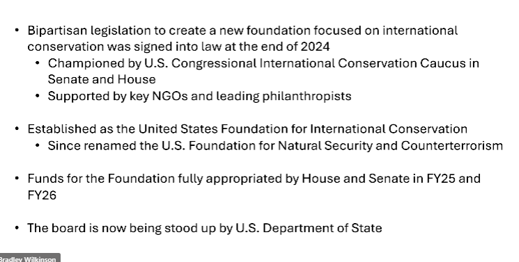
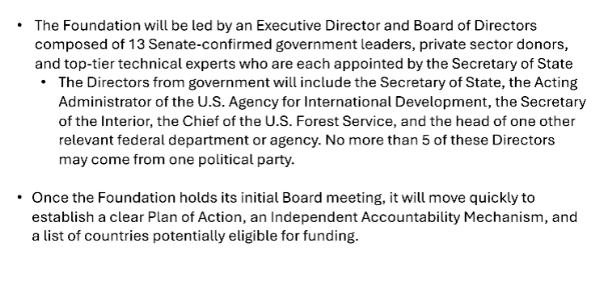

# NABCI Meeting Notes

## Follow Ups

* Conversation about communications - orienting the public to the structure and how the government works. Jennifer Malpass, Jessie Wells
  * operationalized napkin
* Feedback to AF NGTS - NMBCA - feedback on how to make re-starting efficient.
* Central Flyway Council will be working to contribute to Southern Wings program
  * Shaun at AFWA
  * Talk with Brad about this - other steps?
  * Sara - can we do this in the AF?
* How to instigate adding Mexico to the Flyway system?
* Is there a place for a simplified napkin in the SOTB? Perhaps providing context/guidance on where to plug in without "advocating"?

### Communications Subcommittee Follow-Ups

#### Foci (keep small)

1. Big Desire to map Bird Conservation!
2. Ease access to Translation services
3. Assist with website?

### Tasks

## Welcome and Introductions

### Attendees

* In Person
  * Bradley Wilkinson
  * Tammy VerCauteren
  * Amy Gambrill
  * Jennifer Malpass
  * USGS
  * Erin Pierce (USGS)
  * Mike Danto (USGS)
  * Chistopher Churchill (USGS)
  * Aza rep
  * Jessie Walls (Audubon)
  * Tom O'Connell
  * Graham Chanzy (DU)
  * ?? Wallis (DU)
  * Mike Brasher (DU)
  * Kelly Lang (VTech)
  * Todd ? *USGS
  * Todd Fearer
  * Shaun Oldenberger
  * Erin Kershner (USFWS)
  * Mitch Hartley (USFWS)
  * Danielle Plenne (NRCS)
  * Mark Humpert
* Online
  * Rob Clay
  * Amanada Rodewald
  * David Kostersky
  * Rob Clay (Manomet)
  * Alicia Hardin
  * David Yoskowitz
  * Alan Lange
  * Elizabeth (Beth) Lebow
  * Renee Chi
  * Guy Foulks
  * Geoff Geupel
  * John Alexander
  * Jeff Walters (AOS)
  * Jo Anna Lutmerding
  * Jill Deppe
  * Sara Schweitzer
  * Liz Neipert
  * Russ Comeau
  * Deb Hahn
  * Susan Bonfield

## Coordinator Overview

* Jerome Ford still listed as co-chair

## Agency Updates

### USFWS

Eric Kershner

* Update to BCC List - draft document, putting report into internal/DOI review
* Updating MBTA list as well - out in next several weeks - aligns with recent taxonomic changes
* Internal - strategic planning
  * piloting new permitting process
  * sprinting to get new game info...
* NAWCA, NEOTROP Grants - funding levels the same - nothing changed
  * programs slowed by DOI consolidation and review processes - affecting everything.
  * NAWCA has gone through
  * NEOTROP is still delayed - a few more hurdles
  * Hoping to get exemption from higher level review
* NEOTROP - Guy Foulks retired
  * will likely combine last two years appropriation
* NEPA, NHPA, Section 7 - compliance being streamlined in the name of efficiency.
* Jessie Walls - what is the reason that NEOTROP being delayed
  * no official guidance - there is language on 
* No updates to the [10.13 list](https://www.ecfr.gov/current/title-50/chapter-I/subchapter-B/part-10/subpart-B/section-10.13)
* Sara - org chart - could provide, but still in flux for temp structure.

### NRCS

* New Chief - Buckley
* Added "wildlife" as a priority
  * expansion of the migratory game initiative - 17 western states
  * directed Science and Technology to revise conservation practices by the end of this year.
* reorganizing
  * will create a new hub in Raleigh

### USGS

Christopher Churchill (Acting species management research program)

* USGS trying to keep engagement, can't hire full time, but can bring in temporary details.
* Saving Our Avian R (SOAR) - run by Jennifer Malpass
* Funding good - "30% carryover - $7 million" - huh. that means full budget is $23.3 million?
* Interest in coordinating communications
  * conversation about where these responsibilities lie in the government
* BBS/BBL - modernizing these programs
  * trying to improve database architecture and management
  * moving to AWS - getting help from Ft Collins staff, who work on the 
  * modernize and improve securing, improve user experience
  * 2 people running the BBS right now.
  * Shaun - would love to see a summary of who each individual is associated with - where does funding come from?
    * over 1200 volunteers/year
* [Protected Areas Database](https://www.usgs.gov/programs/gap-analysis-project/science/pad-us-data-overview) status - hosted by USGS

### USDA FS - International Programs Office

Liz Lebow

* part of new re-org, have been able to maintain a budget.
* Staffing will likely decrease, b/c DC staff will be asked to move to Salt Lake City
* Now down to 2 people - plan to replace Susan Stine, but will wait until final re-org.
* Able to focus on international partners this year (as opposed to last year)

### DOW

Liz Neipert

* Bird Conservation must tie directly to mission
* List of declining species that if listed, will have the greatest impact on mission.
* Would like to see alignment on threats/actions for the species
  * Pinyon Jay, Desert Thrasher
* Focusing on Sentinal Landscape to conserve species off base working with partners
* Identify areas/actions that streamline with Action Plans
  * working on template
  * threats/conservation actions for species
* Sikes Act Workshop next week.
* Data/Technology
  * must use AKN for bird data

### BLM

Renee Chi

* New Director - Steven Pierce
* Primary purpose is facilitating oil, gas, mining, and timber production.
* Changes our approach from the past
  * big game on priorities
  * new world screwworm
* Wildlife budget is stable, but processes for spending the money have increased.
* HQ staff down by 50%
  * just started doing some minimal hiring
* NOFO on Aug 11 - spending FY26 funds into early march
* very little travel - working on Pinyon Jay strategy (40% of time)

### USDA Farm Service Agency

Alan Lange

* CRP - delivered 3 signups - new iteration is grassland CRP
  * moving from crop lands to range lands
  * monitoring/assessment/evaluation projects - managing portfolio of 40 projects - many with outcome-based research.
* Anticipating a Farm Bill - prepared to adjust depending on content

## New Process: Functional Outcome from Federal Funding Guidance

* Ensure that non-federal partners, including state agencies and non-profit partners, are aware of updated guidance within federal agencies concerning partner funding and review. Explore the possible functional outcomes of this updated guidance, and discuss coordinated strategies ensuring continued funding support for the bird conservation community at large, from both federal and non-federal sources.
* Any messaging to constituents?
* Guidance across all Federal Grants
* Susan Bonfield: point out that some of this is already going on - Federal Grants being changed in mid-grant. Have lost a few projects because of it.
* Bradley - taking what is functionally happening into a codified - wanted to make sure partners don't think the current process will go away - more likey to stick.

## Workshop: Holistic International Migratory Bird Conservation Funding

### NMBCA

* Some latitude in selecting grants - don't have to decide before January.
  * input would be good to see when partners want the NOFO to close after opening
* slate of 25 projects has to be approved by agency, then each has to be approved
* Grant Exemption
  * under last Trump admin, reviewed everything above $50K
  * All awards going through Director and Secretary - "Elevated Review Process"
  * Some programs exempted from this process in the last admin
  * Just last week, allowed the exemption process for programs (each program has to apply separately)
* Congresswoman Salazar sending a letter to Nesvik on this issue.
* HQ will be the last to get new positions approved.
  * will plan on using existing staff to run the program if it moves forward.
* Given there is more funding available - could you extend the grant duration?
  * Tammy/Rob - will be happy to help work through a new process.
  * Shaun - get some input back to you as well from the Technical Sections.

### Southern Wings

Opportunity for this program to augment/cooperatively work on FAC Conservation.

* Set state-specific annual investment goals
* strengthen governance
  * creation/standing up of advisory committee
  * reps from regional associations, and other partners
* Comms/Outreach
  * State: Investment profile - deets on good projects for the state
  * Director Packet: higher-level intro to the program
    * 40% of state agencies have them - hopefully 100% soon
    * being delivered by advisory committee/follow-up calls
    * incorporating data from eBird - observer effort hours, shared stewardship maps
* 25% challenge - reach 25% of their annual goal
* Heading for best year in the history of the program
* Goal: creatively think about how state agencies can facilitate this program.
  * given continued uncertainty in funding opportunities
* Todd: any discussion about addressing barriers (e.g., WV AG prevented investments)?
  * Looking at other flyways to work as the Pacific Flyways contribute.
* Shaun: a lot of non-game programs don't have a lot of state funds to contribute.
* David Y: using state $ is difficult - can we bring private $ to SW? Go out an share great work SW is doing...
  * spending time with rotary club and community to fund these?
  * can this be what part of the state contributes?
  * Where would they send their funding?
  * Deb: no great updates - big barrier - where to find and contribute those funds?
* Tammy: would Flyway goals be useful?
* Funding sources
  * 4-5 PR
  * Most state funding - license fees, tax, etc.
  * Some use SWG

### Briefing: Potential New Resources for Full Annual Cycle Conservation of Migratory Birds

* [US Foundation for Natural Security and Counterterrorism](https://uscode.house.gov/view.xhtml?req=granuleid:USC-prelim-title22-section10602&num=0&edition=prelim)
* Charitable non-profit - $100M/year of public funds
* Match 1:2 public-to-private ratio
* Likely will operate like NFWF.
* Focused on providing long-term support for the effective managemen of protected and conserved areas.
  * funds support implementation-ready projects.
  * conserve biodiversity, enhance prosperity and security, and benefit indigenous peoples and local communities.
  * require long-term binding agreements between NGO - Private Donor - Host Gov

* to date, $200M available to be obligated by the foundation
  * articles of incorporation filed in DE
  * Preparing legal resolutions required to be adopted at first board meeting

#### Proposed Action Item

Develop within the US NABCI Committee a letter to be delivered to the Foundation upon the formation of a Board or hiring of an Executive Director outlining priorities of the bird conservation community for advancing full annual cycle conservation of migratory birds.

* reading between the lines - might not focus on Latin America, but more likley Africa.
* this is currently in the White House level - very delicate - Marco Rubio project

## ENCA: National Conservation Strategy for Birds in Mexico

Humberto Berlanga (Conabio)

* "mainstreaming" - coordinate different sectors of the Gov.
  * intend to do this with the strategy
* Here is a link to the ENCA for Chile - [Estrategia Nacional de Conservación de Aves](https://estrategia-aves.mma.gob.cl/) – ENCA and the ENCA for Colombia [Colombia's National Bird Conservation Strategy Takes Flight | Audubon](https://www.audubon.org/news/colombias-national-bird-conservation-strategy-takes-flight) that Humberto referenced
* Bradley: Best way to communicate after done?
* Conabio now becoming a part of the government - status is in flux

## State of the Birds Terms of Reference

* not much of a protocol in place right now

## Grasslands Landscape Roadmap

* [Constellation Governance Model](https://socialinnovation.org/about/innovations-publications/constellation-model-of-governance/)
* [Spatial Prioritization for Avian Recovery & Rangeland Opportunity](https://apps.birdconservancy.org/sparro/)
* [America's Grasslands Coalition](https://grasslanders.org/)
  * Partnered with GlobeScan to survey folks on their awareness, attitudes, and support for grasslands
  * 16% awareness of grasslands
  * 31% perception of importance rose with awareness (end of survey)
* [Social Media Campaign](https://grasslanders.org)
  * weeklong mini campaign
  * >1 million people
  * 1.7 million across Meta & Google

## NABCI - Place to Crosswalk Different Shorebird Plans

Bradley Wilkinson

Communicating with partners to do a crosswalk that would satisfy the needs of different partners.

* lots of enthusiasm, but some questions about the intended audience...
* What is the geographic scope?
* What is the functional outcome?
* Proof of Concept: Shared Priorities, Overlapping Threats, And Common Conservation Metrics
  * asked LLM to find synergies between the two plans
  * Not to create a unified bird plan, but to highlight commonalities and differences.